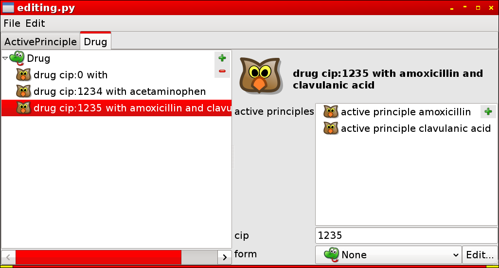

Editing Instances with EditObj3 dialog box generator
=====================================================

The Protégé editor can be used for editing ontology's Classes and Properties, however the 4.x version
of Protégé is very poor for editing Instances. There come EditObj3 and Owlready!

`Editobj3 <https://bitbucket.org/jibalamy/editobj3>`_ is a dialog box generator for Python objects.
EditObj3 can uses the Qt toolkit, but can also be used as a web-server to generate HTML pages
for web browsers.

Owlready can use EditObj3 and set it up automatically to edit ontology's Instances.

.. warning::

   Edition is still an experimental feature!

Generating a dialog box
-----------------------

First we create an ontology with Drug, DrugForm and Active Principle, and various Properties:

::

   >>> from owlready import *

   >>> onto = Ontology("http://test.org/onto.owl")
   
   >>> class Drug(GeneratedName, Thing):
   ...     ontology = onto
   ...     def generate_name(self):
   ...         return "drug_cip:%s_with_%s" % (self.cip, "_and_".join(sorted(ai.inn for ai in self.active_principles)))
   
   >>> class ActivePrinciple(GeneratedName, Thing):
   ...     ontology = onto
   ...     def generate_name(self):
   ...         return "active_principle_%s" % self.inn

   >>> class DrugForm(Thing):
   ...     ontology = onto
   
   >>> tablet     = DrugForm()
   >>> capsule    = DrugForm()
   >>> injectable = DrugForm()
   >>> pomade     = DrugForm()

   >>> class has_for_cip(FunctionalProperty):
   ...     ontology = onto
   ...     domain   = [Drug]
   ...     range    = [int]
   >>> ANNOTATIONS[has_for_cip]["python_name"] = "cip"
  
   >>> class has_for_active_principle(Property):
   ...     ontology = onto
   ...     domain   = [Drug]
   ...     range    = [ActivePrinciple]
   >>> ANNOTATIONS[has_for_active_principle]["python_name"] = "active_principles"

   >>> class has_for_form(FunctionalProperty):
   ...     ontology = onto
   ...     domain   = [Drug]
   ...     range    = [DrugForm]
   >>> ANNOTATIONS[has_for_form]["python_name"] = "form"

   # INN means 'international nonproprietary name'
   >>> class has_for_inn(FunctionalProperty):
   ...     ontology = onto
   ...     domain   = [ActivePrinciple]
   ...     range    = [normstr]
   >>> ANNOTATIONS[has_for_inn]["python_name"] = "inn"

   >>> acetaminophen   = ActivePrinciple(inn = "acetaminophen")
   >>> amoxicillin     = ActivePrinciple(inn = "amoxicillin")
   >>> clavulanic_acid = ActivePrinciple(inn = "clavulanic_acid")
   
   >>> drug1 = Drug(cip = 1234, active_principles = [acetaminophen])
   >>> drug2 = Drug(cip = 1235, active_principles = [amoxicillin, clavulanic_acid])
   >>> drug3 = Drug()

Now, import the ontology editor, configure it from the available ontologies, activate the Qt backend, and edit
the Instances of two Classes (Drug and Active Principle):

::

   >>> import editobj3
   >>> from owlready.editor import *
   >>> from owlready.instance_editor import *

   >>> for ontology in onto.indirectly_imported_ontologies(): configure_editobj_from_ontology(ontology)
   
   >>> editobj3.GUI = "Qt" # "Qt" or "HTML"
   
   >>> if editobj3.GUI == "Qt": # Required by Qt
   >>>     import sys, PyQt5.QtWidgets as qtwidgets
   >>>     if qtwidgets.QApplication.startingUp(): qtwidgets.app = qtwidgets.QApplication(sys.argv)
   
   >>> editor = OntologyInstanceEditor()
   >>> editor.set_ontology(onto, edited_classes = [ActivePrinciple, Drug])
   >>> editor.main()

Notice how Owlready and EditObj take into account the various information available in the ontology
for building the dialog box!

Ordering the Instance's Properties
----------------------------------

Almost all the information needed for generating a dialog box is available in an OWL ontology.
One of the most notable missing information is the order of the Property: in which order should
the fields be displayed?

To specify an order of priority between Properties, you can use the 'editobj_priority' annotation (from the
'owlready_ontology.owl'). In the following example, the CIP code is shown first, then active principles, and
finally Drug form.

::

   >>> ANNOTATIONS[has_for_cip             ]["editobj_priority"] = 1
   >>> ANNOTATIONS[has_for_active_principle]["editobj_priority"] = 2
   >>> ANNOTATIONS[has_for_form            ]["editobj_priority"] = 3

This annotation can of course be set in editor like Protégé.

HTML output
-----------

EditObj 3 can also generate HTML pages in a web browser.
Use the following parameters for HTML:

   >>> editobj3.GUI = "HTML"
